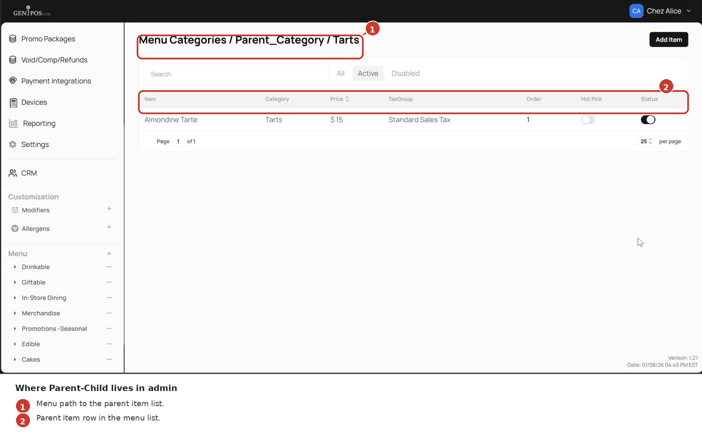
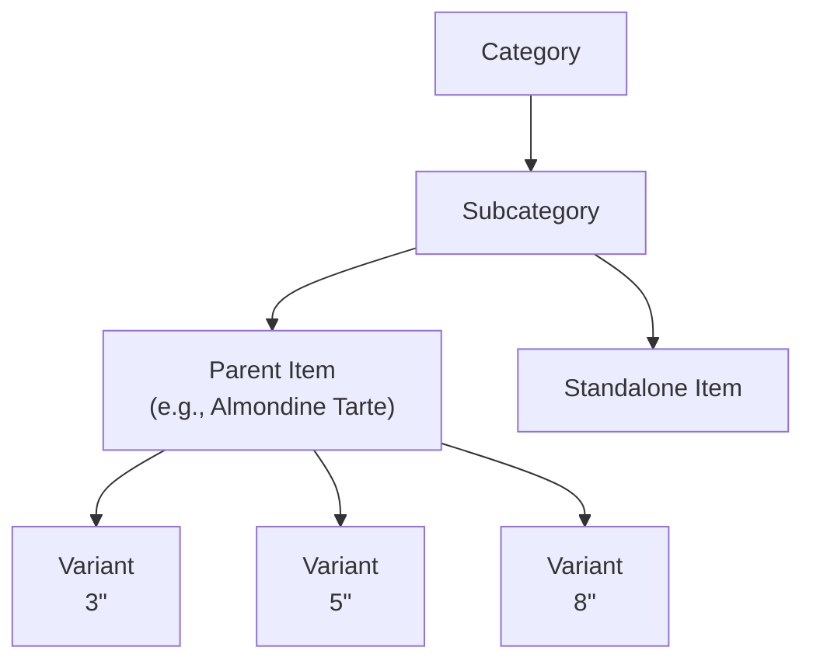

<!--
Document type: Diátaxis Explanation (understanding-oriented).
Target length: ≤ 1 page.
Audience: internal testers and team members (already familiar with Gen1POS basics).
Do not add step-by-step instructions here - those live in the how-to pages (02–05).
Do not add rule tables here - those live in 06-reference-rules.md.
-->

# Parent-Child Structure

Parent-Child Structure lets a single menu item act as a **parent** that groups related child items called **variants** underneath it. Typical use: one item "Almondine Tarte" with variants `3"`, `5"`, and `8"`, instead of three separate items. The feature shapes what the cashier sees on POS, what prints to the kitchen, and how sales appear in reports.

## Who this page is for

- Testers verifying that the feature behaves as specified.
- Team members who need the mental model before reading the how-to pages.

This page assumes you already know how to create and configure a basic menu item in Gen1POS. If you don't, read the base item configuration section in the parent Gen1POS admin manual first.
<!-- TODO(style-alignment): replace the sentence above with a direct link once Maya shares the parent manual URL (Round 1 Q-2). -->

## What you need to know first

Two terms carry most of the weight:

- **Parent item** - a menu item that holds one or more variants. On its detail page you will see a `Variants` section listing the children.
- **Variant** - a menu item that belongs to a parent. In the UI and elsewhere in this documentation, child items are called **variants**.

A menu item is always in exactly one of three states: **standalone** (no parent, no children), **parent** (has at least one variant), or **variant** (belongs to a parent).

*The admin panel shows the path Menu → Categories → Tarts, with Almondine Tarte listed as a parent item.*

## The mental model

Within a category and a subcategory, items sit side by side. Any item can become a parent by acquiring variants; any item can become a variant by being linked to a parent.

A variant inherits the parent's `Product Class`; the variant keeps its own `Price`, `Modifiers`, and other fields. The exact inheritance and per-variant rules are listed in the rules reference.

*The Variants section of the Almondine Tarte detail page lists three variants - 3″, 5″, and 8″.*

## How a variant comes into existence

A variant appears in a parent's `Variants` section in one of two ways:

- **Created inside the parent.** Clicking `Add Variant` on the parent's detail page creates a brand-new item that exists only as a variant.
- **Attached from the item list.** Opening an existing standalone item and choosing a parent from the `Parent Item` dropdown turns that item into a variant of the chosen parent. In the observed flow, parent candidates are restricted to items in the same subcategory.

The two origins matter because **detach behaviour differs based on origin** - see how to remove a variant.

## Where it shows up across the product

The feature affects four surfaces. The rules reference documents each one; short summary here:

- **Admin.** Each variant is listed under its parent in the `Variants` section and has its own editable detail page.
- **POS.** A parent item opens to a row of variant buttons labelled with `Short Name`. One variant can be marked `Pre Chosen` to appear pre-selected.
- **Kitchen ticket.** A purchased variant reaches the kitchen with the item's full identifying name; the exact layout is not documented in v1.
- **ProductMix report.** Each sold variant appears under a composite label that includes both the parent name and the `Short Name`.

## Where to go next

- [How to create a new variant](02-howto-create-variant.md)
- [How to attach an existing item as a variant](03-howto-attach-existing.md)
- [How to reorder variants and set a default](04-howto-reorder-variants.md)
- [How to remove a variant](05-howto-remove-variant.md)
- [Rules reference](06-reference-rules.md)
- [Glossary](07-reference-glossary.md)
- [Known limitations](08-known-limitations.md)
