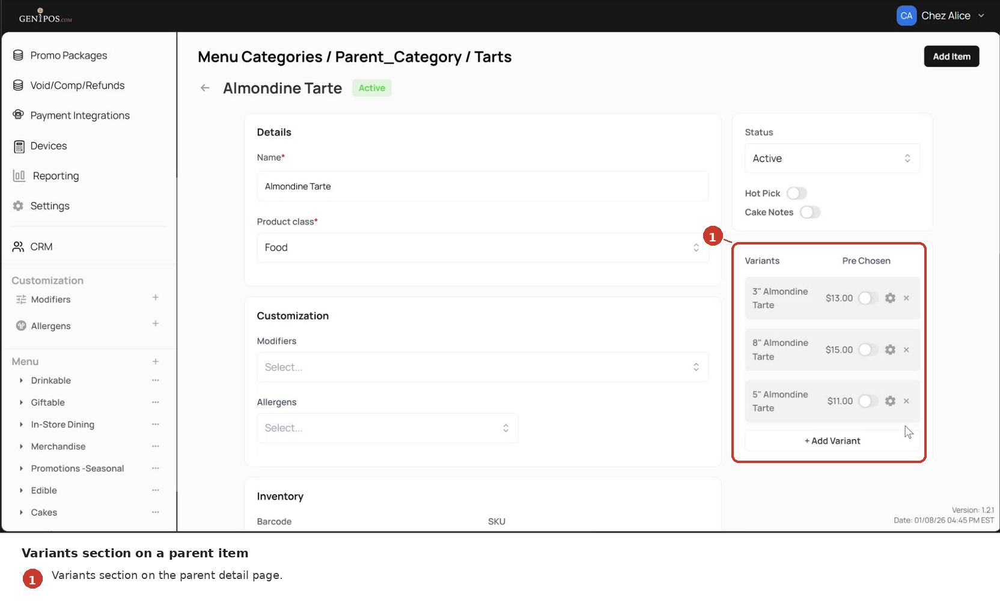
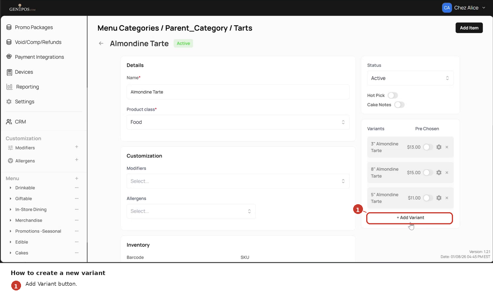
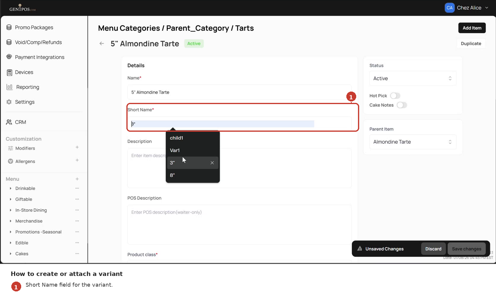
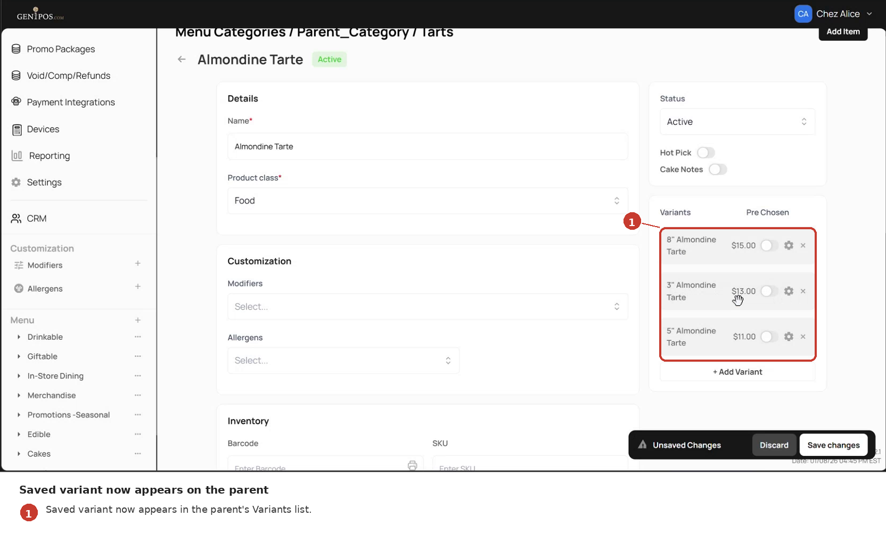

<!--
Document type: Diátaxis How-to (task-oriented).
Target length: 60–100 lines.
Scenario: SC-1 in docs/ba-artifacts/07-scenarios.md.
Capabilities: CAP-1 (create variant) + CAP-3 (Short Name field).
Screenshots: shot_05, shot_06, shot_11, shot_33 (see docs/ba-artifacts/09-shotlist.md).
Style: MS Writing Style Guide procedure pattern - imperative mood, UI labels verbatim.
-->

# How to create a new variant

Use this procedure to add a brand-new variant under an existing parent item - for example, to add a `5"` option to `Almondine Tarte`.

If instead you want to turn an existing standalone item into a variant, follow [How to attach an existing item as a variant](03-howto-attach-existing.md) - the procedure below creates a **new** item that exists only as a variant.

## Before you start

- You have admin access to the Gen1POS admin panel.
- The parent item already exists in a subcategory.
- You are familiar with basic menu item configuration (`Name`, `Product Class`, `Price`, and related fields). If not, see the base item configuration section in the Gen1POS admin manual first.
<!-- TODO(style-alignment): replace the reference above with a direct link once Maya shares the parent manual URL. -->

## Steps

1. In the admin panel, navigate to **Menu** → your category → your subcategory → the parent item (for example, `Almondine Tarte`).

2. On the item's detail page, scroll to the **Variants** section.

   
   *The parent item's detail page has a Variants section where child items are listed.*

3. Click **Add Variant**.

   
   *The Add Variant button sits at the bottom of the Variants section.*

4. Fill in the variant's fields (`Name`, `Price`, and others) using the same procedure as for a basic menu item. `Product Class` is inherited from the parent and does not need to be set - see [Rules reference](06-reference-rules.md) for the inheritance rule.

5. In the **Short Name** field, enter the label that will be shown on POS and in reports - for example, `5"`.

   
   *When an item is configured as a variant, a Short Name field becomes editable on its detail page.*

6. Click **Save changes**.

## Expected result

- A `Product updated` confirmation is shown.
- The new variant appears in the parent's **Variants** section with its **Short Name**.

*After saving, the new variant appears in the parent's Variants list with its Short Name.*

## Notes

- The variant you just created is **variant-born** - it exists only inside the parent. If you later detach it, the item is permanently deleted; it does not return to the subcategory's item list. See [How to remove a variant](05-howto-remove-variant.md) for the detach behaviour.
- No length or character constraints on `Short Name` are documented. See [Known limitations](08-known-limitations.md).

## What's next

- Set the display order of variants and nominate a default - [How to reorder variants and set a default](04-howto-reorder-variants.md).
- Attach an existing standalone item as a variant - [How to attach an existing item](03-howto-attach-existing.md).
- Remove a variant - [How to remove a variant](05-howto-remove-variant.md).
