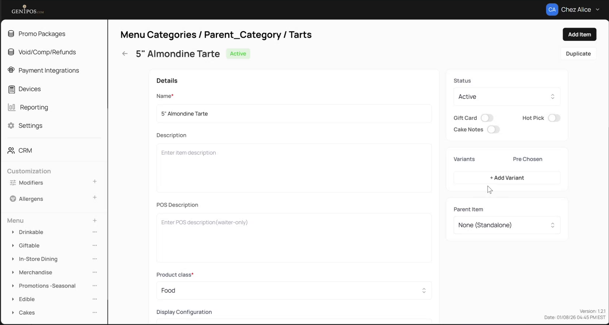
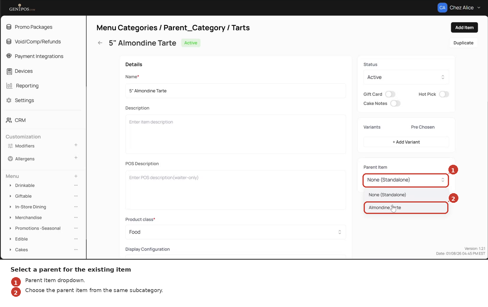
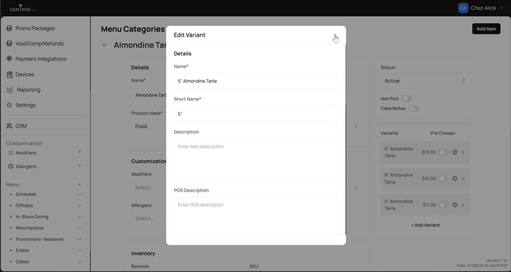

<!--
Document type: Diátaxis How-to (task-oriented).
Target length: 60–100 lines.
Scenario: SC-2 in docs/ba-artifacts/07-scenarios.md.
Capabilities: CAP-2 (attach existing), CAP-3 (Short Name), CAP-12 (subcategory scope).
Screenshots: shot_08, shot_09, shot_10, shot_11, shot_12.
-->

# How to attach an existing item as a variant

Use this procedure to turn an existing standalone menu item into a variant under a parent - for example, to take a separate `5" Almondine Tarte` item and move it under the parent `Almondine Tarte`.

If you want to create a **new** item that exists only as a variant, follow [How to create a new variant](02-howto-create-variant.md) instead.

## Before you start

- You have admin access to the Gen1POS admin panel.
- The item you want to attach is currently **standalone** - its `Parent Item` field shows `None (Standalone)`.
- The target parent item is in the **same subcategory** as the item you want to attach. Items in a different subcategory are not selectable as parents.

*A standalone item appears in the subcategory's item list alongside other items.*

## Steps

1. In the admin panel, navigate to **Menu** → your category → your subcategory → the standalone item.

2. On the item's detail page, locate the **Parent Item** field. For a standalone item it shows `None (Standalone)`.

   
   *The standalone item's Parent Item field is set to None (Standalone).*

3. Open the **Parent Item** dropdown and select the target parent from the list.

   
   *The Parent Item dropdown lists candidate parents from the same subcategory.*

4. In the **Short Name** field that appears, enter the label that will be shown on POS and in reports - for example, `5"`.

   
   *After selecting a parent, the Short Name field appears and must be filled before saving.*

5. Click **Save changes**.

## Expected result

- A `Product updated` confirmation is shown.
- The item is removed from the subcategory's standalone-item list.
- On the parent's detail page, the item now appears in the **Variants** section with its **Short Name**.

*The formerly-standalone item now appears inside the parent's Variants section.*

## Notes

- The variant you just attached is **standalone-origin** - unlike a variant-born item, detaching it will return it to the subcategory's item list as a standalone, not delete it. See [How to remove a variant](05-howto-remove-variant.md) for the detach behaviour.
- If you open the **Parent Item** dropdown and see no candidates, the subcategory contains no other items to act as a parent. Move the item to a different subcategory (via standard item configuration) or create a parent in the current subcategory first.

## What's next

- Set the display order of variants and nominate a default - [How to reorder variants and set a default](04-howto-reorder-variants.md).
- Create a brand-new variant from scratch - [How to create a new variant](02-howto-create-variant.md).
- Remove a variant - [How to remove a variant](05-howto-remove-variant.md).
