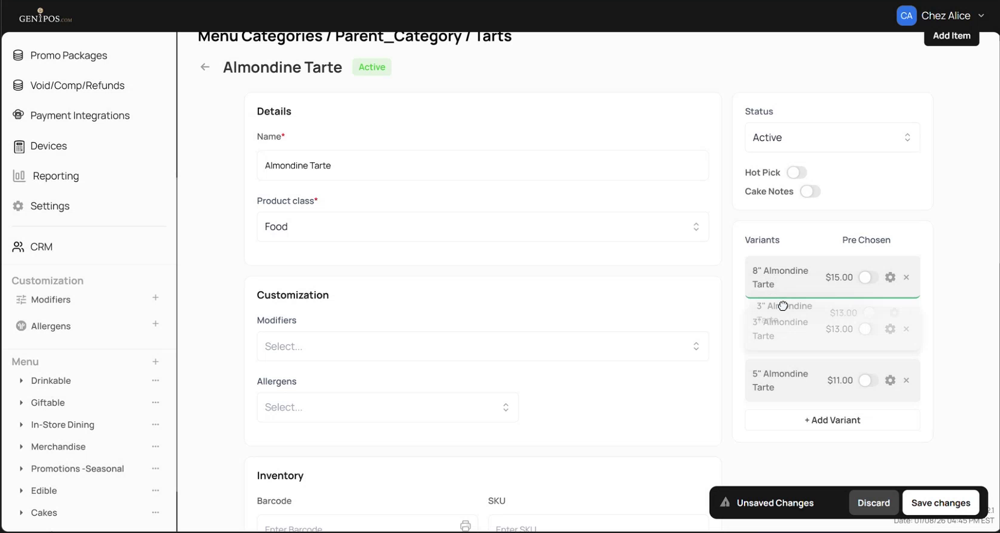

<!--
Document type: Diátaxis How-to (task-oriented).
Target length: 80–120 lines.
Scenarios: SC-3 (reorder + Pre Chosen) and SC-4 (verification on POS).
Capabilities: CAP-4 (reorder + Pre Chosen) + CAP-8 (POS display).
Screenshots: shot_13, shot_15, shot_21 (optional), shot_22 (optional). See docs/ba-artifacts/09-shotlist.md.
Style: MS Writing Style Guide procedure pattern - imperative mood, UI labels verbatim.
-->

# How to reorder variants and set a default

Use this procedure to control how a parent's variants appear on POS - both the **order** in which the cashier sees them and which one is **pre-selected** by default.

If the parent has only one variant, the order is moot, but you can still mark that variant as `Pre Chosen` so it shows up pre-selected on POS.

## Before you start

- You have admin access to the Gen1POS admin panel.
- The parent item already has at least one variant. To add more variants first, see [How to create a new variant](02-howto-create-variant.md) or [How to attach an existing item](03-howto-attach-existing.md).
- You have access to the POS interface (or a test POS session) for the verification step at the end.

## Part 1 - Reorder variants

1. In the admin panel, navigate to **Menu** → your category → your subcategory → the parent item (for example, `Almondine Tarte`).

2. On the item's detail page, scroll to the **Variants** section.

3. Drag each variant by its row to the position you want.

   
   *Variants are reordered by drag; the order saved here drives the order shown on POS.*

4. Click **Save changes**.

## Part 2 - Mark a variant as Pre Chosen

1. On the same parent's detail page, in the **Variants** section, locate the variant you want to be pre-selected on POS.

2. Toggle **Pre Chosen** on for that variant.

3. Click **Save changes**.

A `Product updated` confirmation is shown.

## Verification - confirm the result on POS

1. Switch to the POS interface.

2. Navigate to the category that contains the parent item.

3. Tap the parent item.

   
   *On POS the variants appear under the parent in the saved order, and the Pre Chosen variant is visually pre-selected.*

You should see:

- **Order** - variants displayed left-to-right (or top-to-bottom, depending on POS layout) in the order saved in the admin panel.
- **Labels** - each variant button labelled with its `Short Name` (for example, `3"`, `5"`, `8"`).
- **Pre-selection** - the variant marked `Pre Chosen` is visually highlighted as the active selection.

## Notes

- The `Pre Chosen` toggle is per parent. Whether more than one variant on the same parent can be `Pre Chosen` at once is **not documented in v1** - see [Known limitations](08-known-limitations.md). The screencast shows exactly one variant being toggled.
- The `Short Name` shown on the POS button comes from the variant's detail page. To change a label, change the `Short Name` on that variant.
- If the saved order does not appear on POS as expected, check that you saved changes on the parent's detail page - the drag interaction itself does not auto-save.

## What's next

- Add another variant - [How to create a new variant](02-howto-create-variant.md).
- Move an existing item under this parent - [How to attach an existing item](03-howto-attach-existing.md).
- Remove a variant - [How to remove a variant](05-howto-remove-variant.md).
- Look up the full POS / kitchen / report display rules - [Rules reference](06-reference-rules.md).
