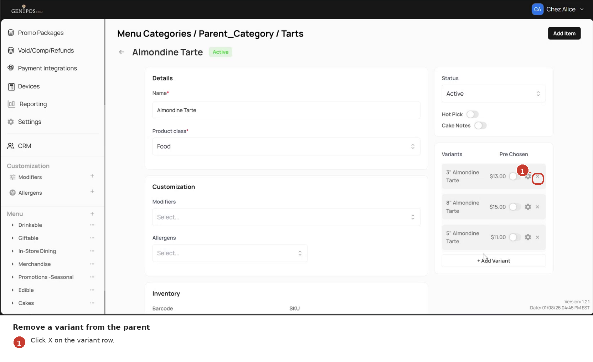
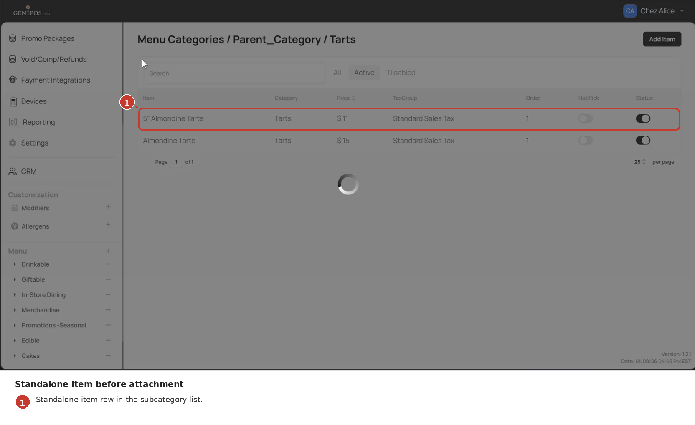
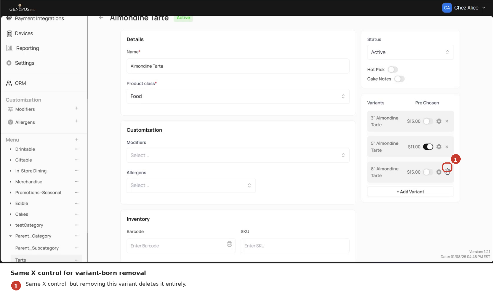

<!--
Document type: Diátaxis How-to (task-oriented).
Target length: 80–120 lines.
Scenario: SC-5 in docs/ba-artifacts/07-scenarios.md.
Capabilities: CAP-5 (detach/delete, origin-dependent outcome).
Screenshots: shot_07, shot_08, shot_31. See docs/ba-artifacts/09-shotlist.md.
Style: MS Writing Style Guide procedure pattern - imperative mood, UI labels verbatim.
Risk note: this how-to documents a destructive operation; the branch-B warning must remain prominent.
-->

# How to remove a variant

Use this procedure to remove a variant from a parent item - for example, to take `5"` off `Almondine Tarte`'s variant list.

> **Read before you click.** What happens to the removed item depends on **how that variant was originally created**. In one case the item returns to your subcategory's item list. In the other case the item is **permanently deleted** with no way to recover it. The two cases are described under [Outcome](#outcome) below.

## Before you start

- You have admin access to the Gen1POS admin panel.
- The parent item has at least one variant.
- You know the variant's **origin** - whether it was created inside the parent (with **Add Variant** - see [How to create a new variant](02-howto-create-variant.md)) or attached from the item list (via the **Parent Item** dropdown - see [How to attach an existing item](03-howto-attach-existing.md)). If you do not know, treat the operation as destructive - see the warning below.

## Steps

1. In the admin panel, navigate to **Menu** → your category → your subcategory → the parent item.

2. On the item's detail page, scroll to the **Variants** section.

3. On the row of the variant you want to remove, click the **X** control on the right.

   
   *Each variant row has an X control on the right. Clicking it removes the variant from the parent.*

4. If a confirmation dialog appears, confirm the action.

## Outcome

The system shows a `Variant deleted` confirmation either way. What happens to the underlying item depends on its origin:

| Origin of the variant | What happens when you click X | Reversible? |
|---|---|---|
| **Standalone-origin** - the item existed in the subcategory before, and was attached as a variant via the **Parent Item** dropdown | The item is detached from the parent and returns to the subcategory's item list as a standalone. Its **Parent Item** field resets to `None (Standalone)`. | Yes - re-attach via [How to attach an existing item](03-howto-attach-existing.md). |
| **Variant-born** - the item was created inside the parent via **Add Variant** and never existed outside it | The item is **permanently deleted**. It does not return to the subcategory's item list and cannot be recovered through the admin panel. | **No.** |

*A previously-standalone variant, once removed, returns to the subcategory's item list as a standalone item.*

*The same X control acts on a variant-born variant - but in this case the underlying item is deleted entirely. There is no separate "deleted item" view to display.*

## Destructive action - variant-born variants

If the variant was created with **Add Variant** and never existed as a standalone item, removing it permanently deletes the item from your menu:

- The item will not appear in the subcategory's item list.
- All configuration on it (`Price`, `Modifiers`, `Allergens`, etc.) is lost.
- There is no admin-panel undo. To restore the item you must recreate it from scratch.

If you want to take the variant off this parent but keep the item available - for example, to move it to a different parent later - open the variant's detail page first, change the **Parent Item** dropdown to a different parent (or to `None (Standalone)`), then save. Detaching via the X control is the wrong tool when the item must survive.

## Notes

- The detach behaviour for the **variant-born** branch is described by the product owner but not separately re-demonstrated in the source materials. Treat the rule above as authoritative; flag any deviation observed in testing.

## What's next

- Re-attach a previously-standalone variant - [How to attach an existing item](03-howto-attach-existing.md).
- Add a different variant in its place - [How to create a new variant](02-howto-create-variant.md).
- Look up the full detach behaviour table alongside related rules - [Rules reference](06-reference-rules.md).
