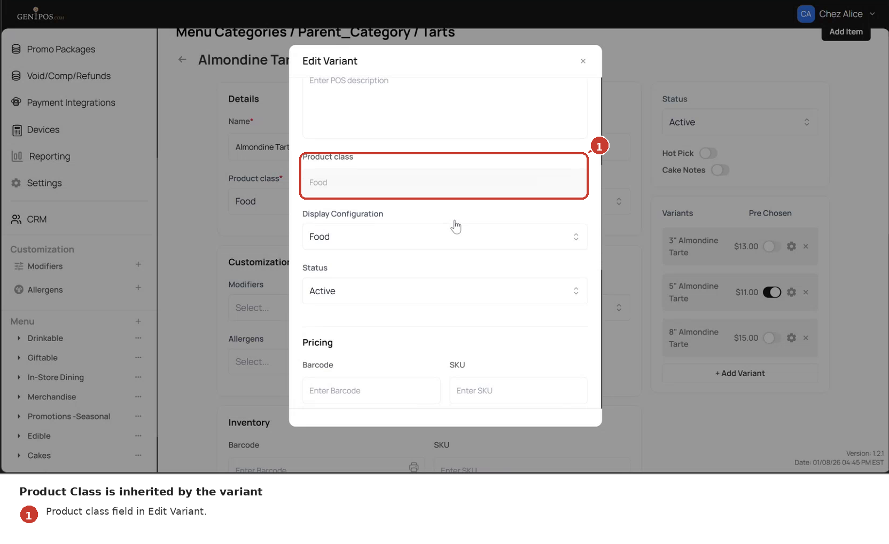
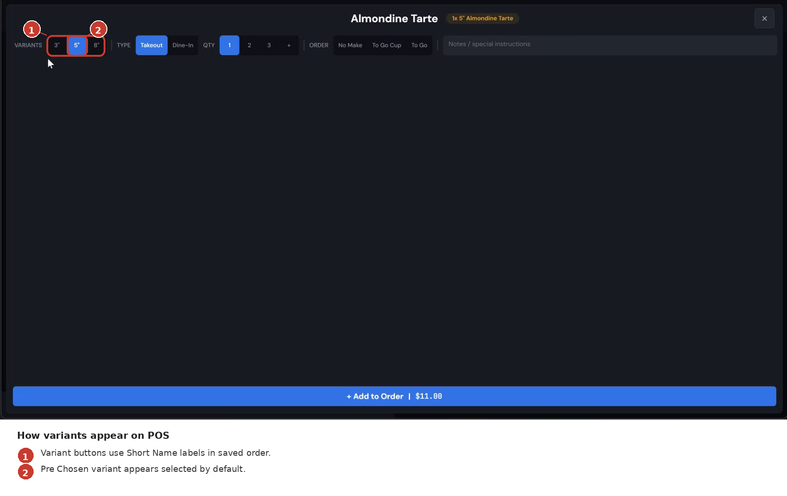
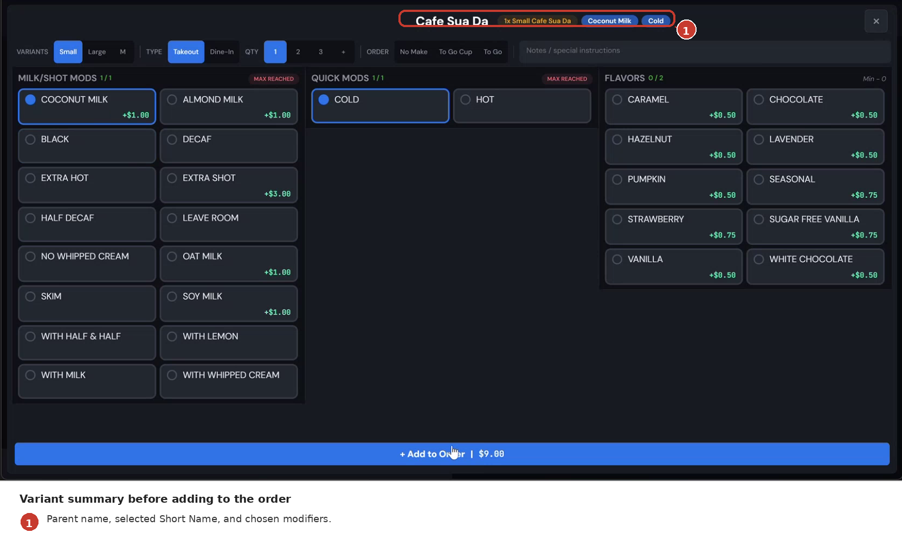
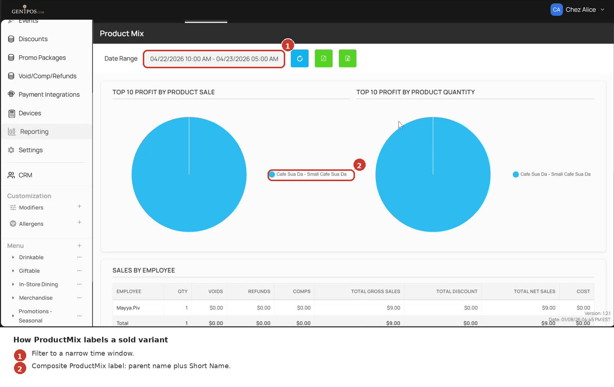
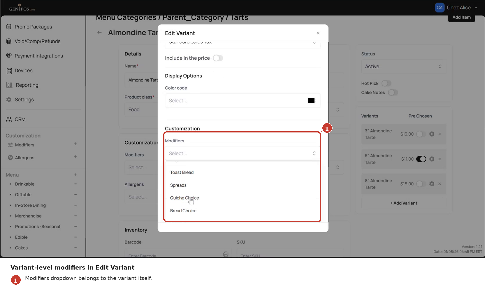
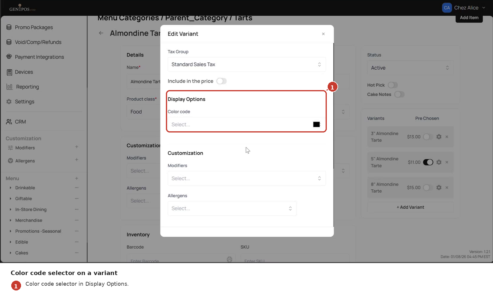

<!--
Document type: Diátaxis Reference (information-oriented).
Target length: 150–250 lines.
Sources: docs/ba-artifacts/05-capability-map.md (CAP-3, CAP-5, CAP-7, CAP-8, CAP-9, CAP-10, CAP-11, CAP-12),
         06-source-matrix.md (publication posture), 09-shotlist.md (illustrations),
         10-rtm.md (claim provenance).
Style: Reference-first - tables and concise rule blocks, not prose. Look-up over read-through.
Phrasing care:
  - C4  (subcategory):     hedge - "Candidate parents are restricted to items in the same subcategory."
  - C10 (Product Class):   hedge - "inherited from parent and displayed on the variant"; do not assert "read-only" without visual confirmation.
  - C11 (Modifiers):       structural only; behaviour → UK10 / 08-known-limitations.md.
  - C14 (Kitchen ticket):  do NOT publish the layout; only state the ticket receives the item; format → UK7 / 08-known-limitations.md.
  - C15 (ProductMix):      reframed as composite label "Parent Name – Short Name Parent Name".
  - C16 (Color code):      structural only; behaviour → UK10 / 08-known-limitations.md.
-->

# Rules reference

This page lists the rules that govern Parent-Child Structure: where the feature appears, what controls each surface, and which fields behave specially. Use it as a look-up; the how-to pages cover the procedures.

Each rule cites the visible source - a screenshot or, when behaviour is product-owner-stated only, a note. Anything that is **not documented in v1** is called out here and detailed in [Known limitations](08-known-limitations.md).

## How to read this page

- **Rule code** (R1, R2, …) - stable identifier, used for cross-references.
- **Rule** - the rule itself, in one or two sentences.
- **Where it applies** - the UI surface or operation it governs.
- **Notes** - known caveats, with a link to [Known limitations](08-known-limitations.md) when the rule has an unverified edge.

---

## R1. Where Parent-Child Structure shows up

The feature affects four surfaces. Each row links to the rule(s) that govern it.

| Surface | What it shows | Rules |
|---|---|---|
| Admin panel | A parent item's detail page has a **Variants** section listing its variants. Each variant has its own editable detail page. | R2, R3, R4, R5, R7, R8 |
| POS (cashier-side) | Tapping a parent opens a row of variant buttons labelled with `Short Name`. The variant marked `Pre Chosen` is visually pre-selected. Order matches the admin-saved order. | R6.1 |
| Order preview | A selected variant shows the parent name together with the `Short Name` and modifier choices. | R6.2 |
| Kitchen ticket | The ticket includes the item's identifying name. The exact layout is **not documented in v1**. | R6.3 |
| ProductMix report | A sold variant appears under a composite label that includes both the parent name and the `Short Name`. | R6.4 |

---

## R2. Short Name

| Aspect | Rule |
|---|---|
| When the field appears | Only on a variant. A standalone item has no `Short Name` field. The field becomes editable as soon as the item is configured as a variant - either by **Add Variant** under a parent (see [How to create a new variant](02-howto-create-variant.md)) or by selecting a parent in the **Parent Item** dropdown (see [How to attach an existing item](03-howto-attach-existing.md)). |
| Where it is used | Variant-button label on POS (R6.1), the second line of the order preview (R6.2), and part of the composite label in the ProductMix report (R6.4). |
| Length / character constraints | **Not documented in v1** - see [Known limitations](08-known-limitations.md). |

---

## R3. Product Class inheritance

A variant's `Product Class` is **inherited from its parent** and is displayed on the variant's detail page. The variant does not have an independent Product Class.

*The Edit Variant modal shows the inherited Product Class field alongside variant-level fields such as `Price`, `SKU`, and `Taxes`.*

This rule is stated by the product owner. The variant's UI displays the Product Class value but the source materials do not include a step that demonstrates trying to change it on the variant. Treat the inheritance rule as authoritative; report any divergence observed in testing.

---

## R4. Subcategory scope for parent selection

In the observed flow, opening the **Parent Item** dropdown on a standalone item shows candidates from the **same subcategory**.

| Rule | Behaviour |
|---|---|
| Same subcategory | In the observed flow, items from a different subcategory are not offered as parent candidates. |
| Cross-subcategory move | Not covered as a Parent-Child action. To attach a parent from another subcategory you must first move the item into that subcategory using the standard item configuration. |

This rule is product-owner-stated; in the source materials the dropdown is shown with a single matching candidate, which establishes the constraint without exhaustively demonstrating cross-subcategory rejection. See [How to attach an existing item](03-howto-attach-existing.md) for the procedure.

---

## R5. Detach behaviour (origin-dependent)

Removing a variant from a parent's **Variants** section produces one of two outcomes, depending on **how the variant was originally created**:

| Origin | Outcome on detach | Reversible? |
|---|---|---|
| **Standalone-origin** - item existed in the subcategory before and was attached via the **Parent Item** dropdown | Item is detached from the parent and returns to the subcategory's item list as a standalone. Its **Parent Item** field resets to `None (Standalone)`. | Yes - re-attach via the dropdown. |
| **Variant-born** - item was created with **Add Variant** and never existed outside the parent | Item is **permanently deleted**. It does not return to the subcategory's item list. | **No.** |

The `Variant deleted` confirmation is shown for both branches. The full procedure and warning are in [How to remove a variant](05-howto-remove-variant.md).

The variant-born branch is product-owner-stated and not separately re-demonstrated in the source materials; product owner re-confirmed the rule. Edge cases involving deletion of the **parent** itself (not the variant) are **not documented in v1** - see [Known limitations](08-known-limitations.md).

---

## R6. Display rules

### R6.1 POS

*Variant buttons on POS use the `Short Name` as label, in the admin-saved order, with the `Pre Chosen` variant pre-selected.*

| Surface element | Rule |
|---|---|
| Variant button label | The variant's `Short Name`. |
| Order of variants | The order saved on the parent's detail page in admin. Drag-reorder + save in admin → POS layout. |
| Default selection | The variant with `Pre Chosen` toggled is visually pre-selected when the operator opens the parent. Whether more than one variant can be `Pre Chosen` simultaneously is **not documented in v1** - see [Known limitations](08-known-limitations.md). |

### R6.2 Order preview

*In the order summary, the selected variant shows the parent name together with the `Short Name` and modifier selections.*

| Element | Rule |
|---|---|
| Top line | Parent item's name. |
| Second line | `Short Name` of the selected variant, followed by the operator-chosen modifiers. |

### R6.3 Kitchen ticket

The kitchen ticket includes the item's full identifying name. **The exact layout is not documented in v1** - the source materials do not include a kitchen-side image. See [Known limitations](08-known-limitations.md).

### R6.4 ProductMix report

*In the ProductMix report, a sold variant appears under a composite label that includes both the parent name and the `Short Name`.*

| Element | Rule |
|---|---|
| Row label | A composite of parent name and `Short Name`. The observed format is `Parent Name – Short Name Parent Name` (for example, `Cafe Sua Da – Small Cafe Sua Da`). |
| Filtering | When the report is filtered to a window that contains only one variant's sales, only that variant's composite label is shown. |

---

## R7. Variant-level fields (`Price`, `Modifiers`, `Allergens`)

Each variant has its own editable `Price`, `Modifiers`, and `Allergens` fields, configured independently of the parent.

*The `Customization` section of the Edit Variant modal exposes per-variant `Modifiers` and `Allergens` dropdowns.*

| Field | Per-variant? | Configurable from | Notes |
|---|:-:|---|---|
| `Price` | Yes | Edit Variant modal / variant's detail page | Independent of the parent's price. |
| `Modifiers` | Yes (structurally - fields are present per variant) | Edit Variant → Customization | The interaction between variant-level modifiers and the Parent-Child context is **not documented in v1** - see [Known limitations](08-known-limitations.md). |
| `Allergens` | Yes (structurally) | Edit Variant → Customization | Same caveat as `Modifiers`. |
| `Product Class` | No (inherited) | Parent's detail page | See R3. |

---

## R8. Color Code

The `Color Code` selector is a display-options field on a variant.

*The `Color code` selector appears in the Display Options section of the Edit Variant modal.*

| Aspect | Rule |
|---|---|
| Field exists per variant | Yes. |
| Effect when the item is part of Parent-Child Structure | **Not documented in v1.** The source materials describe the field as taking effect "outside the parent context", but the meaning of "outside" is not defined and the in-context behaviour is not demonstrated. See [Known limitations](08-known-limitations.md). |

---

## See also

- [Glossary](07-reference-glossary.md) - definitions for `Variant`, `Short Name`, `Parent Item`, and other terms used above.
- [Known limitations](08-known-limitations.md) - what v1 of this manual does not cover and why.
- The how-to pages for the procedures that exercise these rules:
  - [How to create a new variant](02-howto-create-variant.md)
  - [How to attach an existing item](03-howto-attach-existing.md)
  - [How to reorder variants and set a default](04-howto-reorder-variants.md)
  - [How to remove a variant](05-howto-remove-variant.md)
