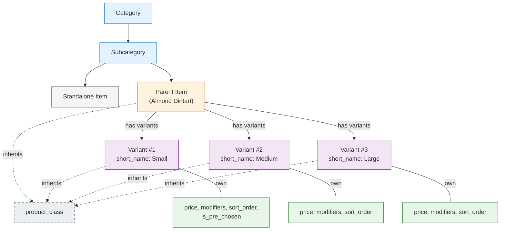
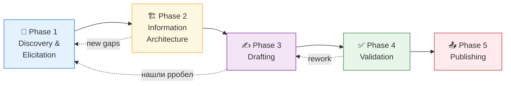

# 🎯 Parent-Child Structure — BA-анализ и план документации

**TL;DR.** Транскрипт — это SME knowledge transfer (не спека), запрос — underspecified ТЗ. Предлагаю методологический стек **DITA + Minimalism + JTBD + Persona-driven** с пятифазным планом от Discovery до Publishing. Критический риск — пробелы в транскрипте (edge cases, термины, аудитория), которые нужно закрыть через follow-up с SME **до старта drafting**, иначе мануал будет «ложно-полным».

---

## 📼 1. Разбор транскрипта

### 1.1. Классификация материала

Транскрипт — это **неструктурированный SME walkthrough**, а не техническая спецификация. Senior BA-шаги с таким материалом:

1. **Деконструкция** на атомарные факты (fact extraction)
2. **Типизация** по DITA: Concept / Task / Reference / Rule
3. **Gap-анализ** — что сказано прямо, что подразумевается, что молчит

### 1.2. Извлечённые факты

| # | Факт | Тип | Якорь в транскрипте |
|---|------|-----|---------------------|
| F1 | Иерархия: **Category → Subcategory → Item → Variants (children)** | Concept | *«Заходим на категорию, субкатегорию и сами айтемы»* |
| F2 | Variant создаётся **двумя путями**: `add variant` (новый) **или** «добавить существующий» | Task | *«либо создавать внутри как add variant … либо добавлять существующие»* |
| F3 | **Открепление variant**: если ранее был standalone — возвращается в общий список; если был создан как variant — **исчезает** | Rule / Edge | *«если айтем был создан как вариант … то он исчезает»* |
| F4 | У variant'а появляется обязательное поле **`short_name`** | Concept | *«у нас появляется дополнительное поле — это short name»* |
| F5 | Variants **reorderable** (drag), порядок отражается на POS | Task | *«Варианты можно двигать, это влияет на то, как они будут отображаться»* |
| F6 | Один variant может быть **pre-chosen** (default-selected на POS) | Task | *«можно выбрать, какие из них будут pre-chosen»* |
| F7 | **Price** настраивается на уровне variant'а независимо | Concept | *«можно менять цену, как у обычного айтема»* |
| F8 | **Product class наследуется** от parent'а (не редактируется на variant) | Rule | *«Product-класс берётся от родительского айтема»* |
| F9 | **Modifiers на variant** применяются **только когда variant вне parent-child** контекста (?) | Rule ⚠️ ambiguous | *«modifiers … влияет на айтем, когда он находится вне parent-детской категории»* |
| F10 | **POS display**: parent name + short_name под ним | Display | *«отображается родительское имя, и рядом с ним внизу … short name»* |
| F11 | **Kitchen ticket**: «полное имя» (семантика требует уточнения) | Display ⚠️ | *«появится полностью название айтема»* |
| F12 | **Reports (ProductMix)**: variant-name, а не parent-name | Display | *«отображается его вариативное имя, а не имя его parent'а»* |
| F13 | Scope выбора existing-item: **только внутри той же subcategory** | Rule | *«Здесь можно выбрать любой айтем из данной субкатегории»* |

### 1.3. Сущностная модель (реконструкция)

### 1.4. Gap-анализ — что молчит транскрипт

| ID | Пробел | Критичность | Владелец ответа |
|----|--------|:-----------:|-----------------|
| **G1** | Что происходит с variants при **удалении parent'а**? Каскад? Detach? | 🔴 High | SME |
| **G2** | Есть ли **max кол-во variants** на parent? | 🟡 Med | SME / Dev |
| **G3** | Может ли variant **сам стать parent'ом** (многоуровневая вложенность)? | 🔴 High | SME |
| **G4** | **Permissions**: кто может создавать/отсоединять variants? | 🟡 Med | SME / Security |
| **G5** | Поведение **F9 (modifiers)** внутри parent-child — какие модификаторы реально применяются? Parent's? None? | 🔴 High | SME |
| **G6** | **Migration**: что происходит со старыми items при включении фичи? | 🔴 High | SME / Dev |
| **G7** | Как выглядит **«full name» на kitchen ticket** (F11) — parent+short? Parent only? | 🟡 Med | SME |
| **G8** | Поведение **discounts / promo** на parent vs variant | 🔴 High | SME |
| **G9** | **Локализация `short_name`** в мультиязычных меню | 🟢 Low | SME |
| **G10** | Поведение в **API / import-export меню** | 🟡 Med | Dev |
| **G11** | Что такое **«пилая сторона»** в терминах продукта (POS / till / cashier view)? | 🟢 Low | SME / Glossary |
| **G12** | Bulk-операции над variants (массовая цена, массовый reorder)? | 🟢 Low | SME |

> ⚠️ **Обнаружено внутреннее противоречие в транскрипте:** на POS показывается `parent_name + short_name` (F10), в ProductMix — *«variant name, not parent name»* (F12), но далее SME говорит *«отображается кафе Среда и его короткое имя»* — что звучит как `parent + short`. Это **семантическая неоднозначность** вокруг «variant name», обязательная к уточнению.

---

## 🔍 2. Разбор запроса

> *«You need to describe how the new Parent-Child structure feature works for the user manual.»*

### 2.1. Что явно

- **Deliverable**: раздел(ы) user manual
- **Subject**: Parent-Child structure
- **Scope-verb**: *«describe how … works»* — функциональное описание

### 2.2. Что умалчивается (implicit / missing)

| Измерение | Что не сказано |
|-----------|----------------|
| **Audience** | Admin / manager / POS-operator / analyst / customer support? |
| **Depth** | Overview / step-by-step / reference / troubleshooting — или всё сразу? |
| **Format** | Markdown в repo / Confluence / Notion / PDF / Help Center (Intercom, Zendesk)? |
| **Length** | 1 страница quick-start или раздел из N подглав? |
| **Tone** | Формально «вы» / неформально «ты»? English-only? |
| **Visuals** | Screenshots, диаграммы, video-walkthrough? Кто их готовит? |
| **Versioning** | Привязка к релизу? Changelog? Версия продукта? |
| **Completeness bar** | Должны ли edge-cases входить в v1 или это v2? |

### 2.3. Вердикт по качеству ТЗ

🟡 **ТЗ underspecified — но это не блокер.** Для Senior BA underspecified input — это **сигнал к elicitation**, а не к стопу. Я формулирую допущения **явно** (см. гипотезы) и использую их как «контракт», который стейкхолдер либо подтверждает, либо корректирует. Это защищает обе стороны: мы не пишем «в пустоту», а заказчик видит, какой продукт реально будет.

---

## 🧭 3. Senior BA Plan

### 3.1. Методологический стек

| Методология | Зачем именно эта |
|-------------|------------------|
| **DITA** (topic-based authoring) | Industry-standard для tech-docs. Разделяет контент на **Concept / Task / Reference** — каждый топик имеет одну функцию, легко переиспользовать и поддерживать |
| **Minimalism (J. Carroll, 1990)** | User manual = **задачи пользователя**, не фичи системы. Меньше теории, больше «сделай X», fast path к цели |
| **JTBD** (Jobs-to-be-Done) | Фреймирую разделы от **цели пользователя** («Я хочу настроить размеры кофе…»), а не от структуры UI. Это и есть разница между «tour of features» и «useful manual» |
| **Persona-driven writing** | ≥2–3 ролей (admin, operator, analyst) — адаптирую глубину, примеры, терминологию под роль |
| **BABOK v3** (elicitation techniques) | Структурно закрываю gap'ы: interview, document analysis, observation, prototyping — каждая техника под свой тип пробела |
| **RTM** (Requirements Traceability Matrix) | Каждый факт в мануале ↔ источник (цитата SME / скриншот / тест). Защита от вопроса *«откуда ты это взял?»* и от drift'а при изменениях фичи |
| **Information Mapping** (R. Horn) | Для reference-блоков: **предсказуемая структура** — definition → procedure → example → constraints |

**Почему не X?** Не предлагаю Agile-документацию или DDD glossary потому, что задача **разовая, single-stakeholder, stable scope** (feature уже в проде). Тяжёлые фреймворки тут — overhead.

### 3.2. Гипотезы

> В BA-контексте гипотеза = явное предположение, которое **будет валидировано или опровергнуто** в фазе Discovery. Явное формулирование гипотез — это трансфер «скрытых рисков» в «управляемые задачи».

| # | Гипотеза | Почему важна | Как валидирую |
|---|----------|--------------|---------------|
| **H1** | Основная аудитория — **restaurant admins/managers**, настраивающие меню | Определяет глубину, термины, отсутствие dev-деталей | Подтверждение у product owner |
| **H2** | Транскрипт содержит **существенные пробелы** (G1–G12) | Без follow-up мануал будет ложно-полным | Batch-сессия с SME |
| **H3** | Фича **кросс-функциональна** (admin → POS → kitchen → reports) — пользователь должен иметь сквозную ментальную модель | Требует отдельной главы «how it appears across the system» | Architecture-diagram review с SME |
| **H4** | У читателей есть **существующая ментальная модель** `item + modifier`. Parent-Child — **новый концепт** | Нужен explainer + явное сравнение «parent-child vs modifier» | User interview (2–3 admin'а) |
| **H5** | Терминология в транскрипте **непоследовательна** (variant / child / parent-child / айтем) | Glossary — **prerequisite**, не deliverable | Normalize до drafting |
| **H6** | Фича **уже в проде** → документируем **как есть**, не «как должно быть» | Нет окна на «что если…», мы descriptive, не prescriptive | UI walkthrough + F-list |

### 3.3. Фазовый план

#### 🔎 Phase 1 — Discovery & Elicitation
| | |
|-|-|
| **Цель** | Закрыть пробелы G1–G12, согласовать scope/audience/format |
| **Вход** | Транскрипт, запрос, доступ к продукту/SME |
| **Выход** | Glossary v1, Personas v1, закрытые gap'ы, scope-contract |
| **Техники** | SME-interview (batch Q&A), UI walkthrough, document analysis, observation |

#### 🏗 Phase 2 — Information Architecture
| | |
|-|-|
| **Цель** | Спроектировать **скелет мануала до первой строки текста** |
| **Выход** | TOC, DITA topic map, User Journey Map, screenshot shot-list, RTM v1 |
| **Ключевой приём** | Каждый топик — с чёткой категорией: *Concept / Task / Reference / Troubleshooting* |

#### ✍️ Phase 3 — Drafting
| | |
|-|-|
| **Цель** | Написать по outline, minimalism-style |
| **Принципы** | 1 task = 1 user goal; примеры из реального меню (Almond Dintart, café sizes) |
| **Артефакт** | Draft v1 |

#### ✅ Phase 4 — Validation
| | |
|-|-|
| **Техники** | SME technical review, peer BA review, cognitive walkthrough на 1–2 target users |
| **Quality gates** | Все пункты RTM покрыты; нет висящих gap'ов; все скриншоты актуальны |

#### 📤 Phase 5 — Publishing
| | |
|-|-|
| **Цель** | Доставить в нужный формат/место, уведомить стейкхолдеров |
| **Выход** | Final manual + commit/push + announcement |

### 3.4. Артефакты (end-to-end deliverables)

| # | Артефакт | Фаза | Назначение |
|---|----------|:---:|------------|
| A1 | `glossary.md` | 1 | Термины-якоря для команды и мануала |
| A2 | `personas.md` | 1 | Кто наш читатель, что он знает, чего хочет |
| A3 | `user-journey-map.md` | 1–2 | Сквозной путь через фичу: Admin → POS → Kitchen → Report |
| A4 | `sme-qa-log.md` | 1 | Трейс вопросов/ответов, закрытие G1–G12 |
| A5 | `toc-topic-map.md` | 2 | Скелет мануала в DITA-разметке |
| A6 | `rtm.md` | 2–5 | Traceability: факт ↔ источник |
| A7 | `manual-v1.md` (draft) | 3 | Первая полная итерация |
| A8 | `review-log.md` | 4 | Коммент → resolution |
| A9 | `manual-final.md` | 5 | Готовая публикация |

### 3.5. Риски и митигация

| Риск | Вер-ть | Impact | Митигация |
|------|:------:|:------:|-----------|
| SME недоступен / медленно отвечает | High | High | Batch-вопросы одним списком; параллельно — проверка через UI |
| Скрытые edge cases всплывают **после** публикации | Med | High | Жёсткий gate «все G закрыты» перед Phase 3; versioned doc с changelog |
| Разные stakeholders хотят разный tone/depth | Med | Med | Persona-driven structure: overview + per-role sections |
| Фича меняется пока пишем | Med | High | Scope-freeze agreement с product owner перед Phase 3 |
| Мисс-перевод в транскрипте («пилая сторона», «эмоции») | Low | Low | Normalize в glossary на Phase 1 |
| Конфликт между F10 и F12 (parent_name vs variant_name) | **High** | **High** | 🔴 Приоритет #1 для SME-сессии |

### 3.6. Definition of Done для мануала

- ☑️ Все G1–G12 закрыты или **явно помечены** как out-of-scope
- ☑️ RTM: 100 % утверждений ↔ источник
- ☑️ Passed cognitive walkthrough на 1+ реальном пользователе (persona-match)
- ☑️ SME sign-off на техническую корректность
- ☑️ Peer review (стиль, структура)
- ☑️ Опубликовано в согласованном формате/локации

---

## ❓ 5. Вопросы на уточнение (unblock для Phase 1)

Чтобы перейти от плана к действию, нужны ответы. Сгруппированы по приоритету:

### 🔴 Блокирующие (без ответа нельзя начинать)
1. **Аудитория.** Кто первичный читатель — admin-менеджер ресторана, внутренний support, POS-оператор, или несколько ролей с разной глубиной?
2. **Формат и локация.** Куда пишется — Confluence / Notion / Help Center / `docs/` в репо / PDF?
3. **Доступ к SME.** Можно ли запланировать 30-минутную follow-up сессию с автором транскрипта для закрытия G1–G12?
4. **Доступ к продукту.** Есть ли учётка admin-панели для верификации, снятия скриншотов, проверки edge-cases?

### 🟡 Формирующие scope
5. **Объём.** Быстрый how-to (1–2 стр.) или полноценный раздел (5–10+ стр. со скриншотами)?
6. **Edge cases в v1.** Включаем G1/G3/G5/G6/G8 сразу или это v2?
7. **Визуалы.** Ожидаются screenshots / диаграммы / video-walkthrough? Кто их делает и утверждает?
8. **Язык и локализация.** EN-only или потребуется RU и другие?

### 🟢 Уточняющие
9. **Существующий style-guide.** Есть ли в проекте шаблон мануала, glossary, tone-of-voice guide, которые нужно соблюсти?
10. **Релиз-привязка.** Фича уже GA или к ближайшему релизу? Changelog куда?

---

**Следующий шаг от меня** (после ваших ответов на блокирующие вопросы): вхожу в **Phase 1 — Discovery**, готовлю черновой `glossary.md` + `personas.md` + **batch SME-вопросов** по G1–G12, и согласовываю с вами scope-contract. Drafting не начинаю, пока scope не закрыт — это анти-паттерн и источник переработок.
